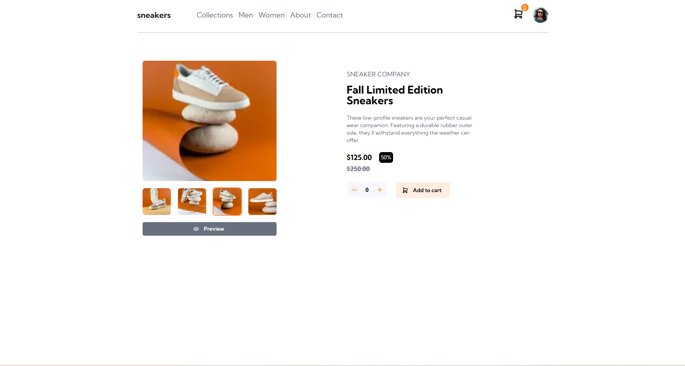

# Frontend Mentor - E-commerce product page solution

This is a solution to the [E-commerce product page challenge on Frontend Mentor](https://www.frontendmentor.io/challenges/ecommerce-product-page-UPsZ9MJp6). Frontend Mentor challenges help you improve your coding skills by building realistic projects.

- [Overview](#overview)
  - [The challenge](#the-challenge)
  - [Screenshot](#screenshot)
  - [Links](#links)
- [My process](#my-process)
  - [Built with](#built-with)
  - [What I learned](#what-i-learned)
- [Author](#author)
- [Acknowledgments](#acknowledgments)

## Overview

### The challenge

Users should be able to:

- View the optimal layout for the site depending on their device's screen size
- See hover states for all interactive elements on the page
- Open a lightbox gallery by clicking on the large product image
- Switch the large product image by clicking on the small thumbnail images
- Add items to the cart
- View the cart and remove items from it

### Screenshot

### Links

- Solution URL: https://github.com/Fanu-Cd/frontend-mentor-ecommerce-product-page
- Live Site URL: https://frontend-mentor-ecommerce-product-page-seven.vercel.app/

### My process

### Built with

- Semantic HTML5 markup
- CSS custom properties
- Flexbox
- CSS Grid-HTM
- Mobile-first workflow
- [React](https://reactjs.org/) - JS library
- [Next.js](https://nextjs.org/) - React framework
- [Tailwindcss](https://tailwindcss.com/) - CSS Framework
- [Mantine UI](https://mantine.dev/) - UI Library
- [Tabler Icons](https://tabler.io/icons) - React Icons Library
- [Vite](https://vite.dev/) - Build tool

### What I learned

What I Learned While I Implemented the ecommerce product page

- Built a responsive product page layout that adapts smoothly to all screen sizes using React and Next.js.

- Used Mantine Carousel and Portal(Full screen Overlay) to create a lightbox gallery that opens on images preview.

- Implemented thumbnail image selection to dynamically update the main product image.

- Managed cart functionality including add-to-cart, view cart, and remove items using React state.

- Applied hover effects to all interactive elements for better user experience and feedback.

- Used Mantine hooks like useDisclosure to control modals and useMediaQuery to control responsiveness

- Gained experience integrating design and interactivity using Mantine components with Tailwind styling.

## Author

- Website - [Fanuel Amare](http://fanuel-amare-personal-portfolio-v2.vercel.app/)
- Frontend Mentor - [@Fanu-Cd](https://www.frontendmentor.io/profile/Fanu-Cd)
